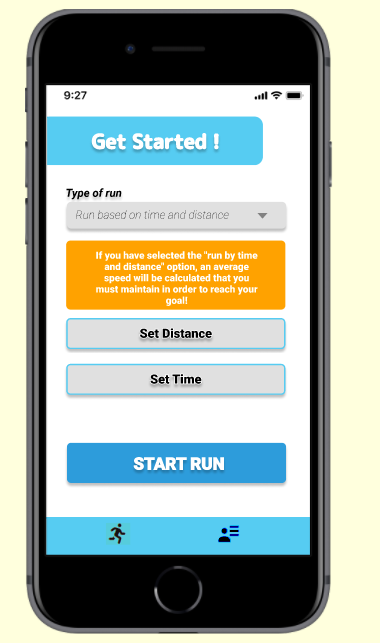
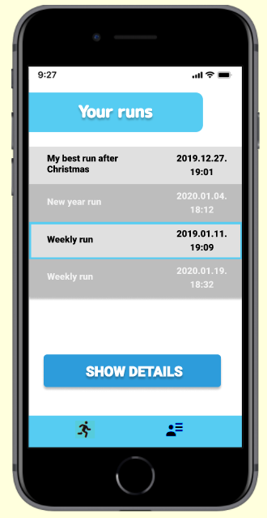
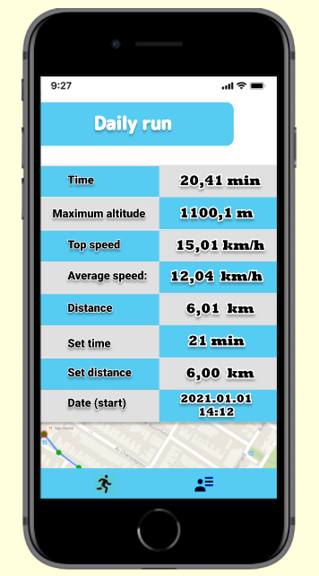
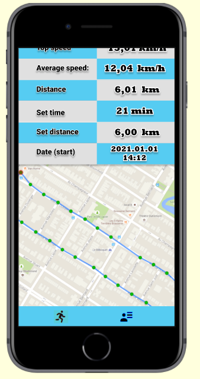

Ide írjuk a specit, mindenki szerkessze bátran, csak derítsük ki a követelményeket!

#  _Térinformatikai és távérzékelési alkalmazások fejlesztése:_ RunningManager 

## Készítette:
**Jónás Eszter Laura. 
Horváth Milán. 
Kovács Levente**

## Feladat:

Futás teljesítmény mérő: A feladat egy olyan mobil alkalmazás megvalósítása, amely asszisztál futás során (pl. figyelmeztetés időtartamra, alacsony sebességre, megállásra), illetve lehetővé teszi a teljesítmény utólagos megtekintését (átlagsebesség, vertikális változások, útvonal térképes alapon, stb.).

## Leírás:

A célunk egy olyan mobilalkalmazás készítése ami futás közben képes asszisztálni és motiválni a felhasználót. Ennek az alkalmazásnak a segítségével  időintervallum és távolság alapján folyamatosan nyomonkövethetjük, hogy az utunkat, szinten tarthatjuk a sebességünket, hogy a kívánt idő alatt elérjük célunkat. 

## Plattform: Mobileszközök, okostelefonok

## Használt technológia:

**React Native:** egy nyílt forrású mobil applikációs keretrendszer ami a Facebook által lett készítve. Ennek segítségével Androic, iOS, macOS, Web, Windows operációs rendszerekre vagyun képesek fejleszteni alkalmazásokat és lehetővé teszi a fejlesztőknek hogy React keretrendszert használjanak a natív platform képességeivel. 

**Expo:** egy keretrendszer és egy egy platform univerzális React alkalmazásokhoz. Előnye hogy könnyű tesztelni éles eszközök, hisz egyből a saját eszközünkön jelenik meg az általunk megírt alkalmazás. 

## Funkciók

1. Az alkalmazás megnyítását követően a "Get started" screen-re irányítja a felhasználót.
2. A képernyő alján egy navigációs fül található, ahol a felhasználó a 2 alapvető képernyő között navigálhat tetszőlegesen
3. A két alapvető képernyő a "Get started" illetve a "Your runs" fül alatt található.
5. A "Get started" képernyőn a felhasználó beállíthatja a tervezett futásának paramétereit, például a futás típusát: szabad futás, időhöz kötött futás, távolsághoz kötött futás, időhöz és távolsághoz kötött futás.
6. Miután kiválasztotta a futás típusát megjelennek a futáshoz szükséges egyéb paraméterek, például időhöz kötött futás esetén az időintervallum választó bemenet, távolság alapú futás esetén a távolságot kell megadnia a felhasználónak, és értelemszerűen ha mindkettő szerint fut akkor mindkettőt meg kell adni. Szabad futás esetén nem jelenik meg efajta extra paraméter.
7. Ezen az oldalon elhelyezkedik egy olyan gomb amivel a beállított paraméterek alapján megkezdheti a felhasználó a futást egy új képernyőre viszi őt eközben. Ezen a képernyőn megjelenik egy stopperóra ahol az idejét tudja figyelni, kiolvashatja a közelítő sebességét, valamint hogy eddig mennyit futott. Ezen kívül egy megjelenik egy sebességmutató jelenik meg, ahol nézheti hogy az átlag sebesség (idő és távolság alapú futás esetén pedig a kívánt átlagsebesség) alapján mennyivel fut, valamint egy térkép ahol nyomon követheti futását.
8. Miután befejezte futását a megfelelő gomb lenyomásával leállíthatja a folyamatot. Ekkor kérhet elemzést a programtól a felhasználó, ahol megkapja az átlagsebességét, a távolságot amennyit futott, a maximális sebességét, és egy térképen megjeleníti a futását. A térképen egyenletesen ellenörzőpontok segítségével további adatokat olvashat le a futásának részleteiről az adott pontban.
9. Miután végzett az elemzéssel a felhasználó kérheti hogy elmentse az adott futás vizsgálatát a helyi tárolóba.
10. A másik fő képernyőn a "Your runs"-ban megtekintheti a felhasználó az elmentett eredményeit és ezeket újra megvizsgálhatja a térképen (mint ahogy a futás elemzésénél is).

## Az alkalmazás felületi terve

      
    

