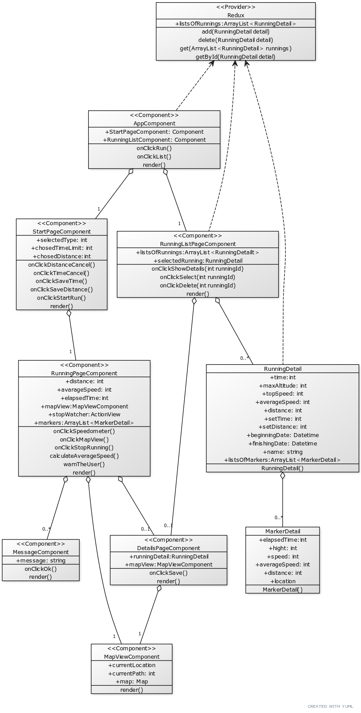

#  _Térinformatikai és távérzékelési alkalmazások fejlesztése:_ RunningManager 

## Készítette:
**Jónás Eszter Laura, 
Horváth Milán,  
Kovács Levente**

## Feladat:

Futás teljesítmény mérő: A feladat egy olyan mobil alkalmazás megvalósítása, amely asszisztál futás során (pl. figyelmeztetés időtartamra, alacsony sebességre, megállásra), illetve lehetővé teszi a teljesítmény utólagos megtekintését (átlagsebesség, vertikális változások, útvonal térképes alapon, stb.).

## Leírás:

A célunk egy olyan mobilalkalmazás készítése ami futás közben képes asszisztálni és motiválni a felhasználót. Ennek az alkalmazásnak a segítségével  időintervallum és távolság alapján folyamatosan nyomonkövethetjük, hogy az utunkat, szinten tarthatjuk a sebességünket, hogy a kívánt idő alatt elérjük célunkat. 

## Használt programozási nyelv: 

JavaScript

## Plattform: 

Mobileszközök, okostelefonok

## Operációs rendszerek:

Android, iOS

## Használt technológiák:

**React Native:** egy nyílt forrású mobil applikációs keretrendszer ami a Facebook által lett készítve. Ennek segítségével Android, iOS, macOS, Web, Windows operációs rendszerekre vagyun képesek fejleszteni alkalmazásokat és lehetővé teszi a fejlesztőknek hogy React keretrendszert használjanak a natív platform képességeivel. 

**Expo:** egy keretrendszer és egy egy platform univerzális React alkalmazásokhoz. Előnye hogy könnyű tesztelni éles eszközök, hisz egyből a saját eszközünkön jelenik meg az általunk megírt alkalmazás. 

**Redux:** A Redux egy JavaScript appokhoz szánt alkalmazás szintű "kiszámítható" állapot tároló, ami segít a fejlesztőknek egy konzisztens viselkedésű alkalmazás megírásában.

## Egyéb fontosabb használt csomagok:

- **expo-location** : a folyamatos pozició változtatás követéséhez használt eszköz.
- **react-native-paper** : az alkalmazás stílusozásához használt eszköz.
- **react-native-maps** : a térképes megjelenítéshez használt eszköz.
- **react-native-speedometer** : a sebességmérő szimulálására használt eszköz.
- **asyncStorage**: a permanens tároláshoz
- **react-native-chart-kit**: diagram készítés a futás adataiból

## Futtatás

Az alkalmazás futtatásához az Expo Go mobil app szükséges.

## Funkciók

1. Az alkalmazás megnyítását követően a "Get started!" screen-re irányítja a felhasználót.
2. A képernyő alján egy navigációs fül található, ahol a felhasználó a 2 alapvető képernyő között navigálhat tetszőlegesen
3. A két alapvető képernyő a "Get started" illetve a "Your runs" fül alatt található.
5. A "Get started" képernyőn a felhasználó beállíthatja a tervezett futásának paramétereit, például a futás típusát: szabad futás, időhöz kötött futás, távolsághoz kötött futás, időhöz és távolsághoz kötött futás.
6. Miután kiválasztotta a futás típusát megjelennek a futáshoz szükséges egyéb paraméterek, például időhöz kötött futás esetén az időintervallum választó bemenet, távolság alapú futás esetén a távolságot kell megadnia a felhasználónak, és értelemszerűen ha mindkettő szerint fut akkor mindkettőt meg kell adni. Szabad futás esetén nem jelenik meg efajta extra paraméter.
7. Ezen az oldalon elhelyezkedik egy olyan gomb amivel a beállított paraméterek alapján megkezdheti a felhasználó a futást egy új képernyőre viszi őt eközben. Ezen a képernyőn megjelenik egy stopperóra ahol az idejét tudja figyelni, kiolvashatja a közelítő sebességét, valamint hogy eddig mennyit futott. Ezen kívül egy megjelenik egy sebességmutató jelenik meg, ahol nézheti hogy az átlag sebesség (idő és távolság alapú futás esetén pedig a kívánt átlagsebesség) alapján mennyivel fut, valamint egy térkép ahol nyomon követheti futását.
8. Miután befejezte futását a megfelelő gomb lenyomásával leállíthatja a folyamatot. Ekkor kérhet elemzést a programtól a felhasználó, ahol megkapja az átlagsebességét, a távolságot amennyit futott, a maximális sebességét, és egy térképen megjeleníti a futását. A térképen egyenletesen ellenörzőpontok segítségével további adatokat olvashat le a futásának részleteiről az adott pontban.
9. Miután végzett az elemzéssel a felhasználó kérheti hogy elmentse az adott futás vizsgálatát a helyi tárolóba.
10. A másik fő képernyőn a "Your runs"-ban megtekintheti a felhasználó az elmentett eredményeit és ezeket újra megvizsgálhatja a térképen (mint ahogy a futás elemzésénél is).
11. Az alkalmazás futás közben figyelmeztet az esetleges célidő közelettére 10%-kal a vége elött. 
12. Az alkalmazás futás közben figyelmeztet az esetleges céltáv elérésének közelettére 10%-kal a vége elött.
13. Az alkalmazás figyelmeztet ha a kívánt sebesség (esetleges átlagsebesség) alatt teljesít a felhasználó.

## Használat - eset diagram

 

## Az alkalmazás felületi terve

Az alkalmazás alapvetően 4 oldalt tartalmaz, ebből 2 érhető el közvetlenül a képernyő alján lévő menüből (1. , 2.)

1. **"Getting started"** - Ezzel nyitódik meg az alkalmazás miután megnyitottuk. Itt kezdheti el a felhasználó a futását, ahol beállíthatja hogy milyen típusú futást akar kezdeni, és ez alapján beállíthatja a szükséges opciókat.
2. **"Your runs"** - Itt találja a felhasználó kilistázva az elmentett futásait névvel és dátummal ellátva. Egy futását kiválasztva és a "Show details" gomb lenyomásával átnavigálja a következő (3.) oldalra a felhasználót a megfelelő adatokkal.
3. **"Details"** - Az adott futás adatait listázza ki és jeleníti meg térképen, ahol bizonyos pontoknál további részleteket kaphat a futásáról.
4. **"Action view"** - A futás közben ezt a képernyőt látja a felhasználó, itt két alnézetet is megtekinthet ahol egy sebességmérőn nézheti, hogy az átlagsebességhez képest mekkora a sebessége, valamint a térképen követheti végig mozgását. Mindemellett a futásának jelenlegi adatait is nyomon követheti.
 

## Osztály diagram

 

## Felhasználói dokumentáció – használati útmutató

A program futtatás után a főképernyőre dob. Ezen a képernyőn kiválaszthatjuk a futással kapcsolatos célkitűzéseinket.

- **Run based on time and distance:** idő és távolság alapú futás. Kötelező paramétereinek szükséges megadni értéket, Set distance, Set time.
- **Run based on time:** Idő alapú futás. Megválaszthatjuk, hogy mennyi ideig szeretnék futni. Kötelező paraméterének – Set time – szükséges értéket adni. 
- **Run based on distance:** Távolság alapú futás. Ebben a módban kötelezően meg kell választanunk a céltávolságot Set distance paraméternek megadva. 
- **Free run:** Szabad futás opció, ha ezt választjuk korlátlanul futhatunk.

A **Start run!** gombbal indíthatjuk el a futást.
 
## Futás akció képernyő

Visszaszámlálás után az akcióképernyőt láthatjuk. Megjelenik számunkra egy sebességmérő, egy stopper, mely másodperc alapon számlálja az eltelt időt és egy térkép, amelyen megjelenik az aktuális pozíciónk. A felületen továbbá látható az átlagsebességünk **Average Speed** illetve a megtett távolság **Distance**. Ha lassan futunk, vagy megálltunk a program figyelmeztet bennünket, hogy lassan haladunk *You are too slow!* felirattal.
Amennyiben a távolság vagy idő alapú futást választottuk, a program a céltávolság elérésekor, és 95% teljesítése esetén is figyelmeztet bennünket, hogy sikerült elérnünk, illetve közeledünk a cél eléréséhez. Az idő alapú futás esetén a program az idő leteltének 80%-ánál figyelmeztet bennünket hogy hamarosan letelik az idő, illetve a cél elérésénél ismételten, hogy lejárt az idő. 
A **Stop run!** gombbal leállíthatjuk a futást ekkor befejeztük, és a program átnavigál bennünket egy másik képernyőre.

## Futás összegző, és elemző képernyő – Your run

Ezen a képernyőn láthatjuk futásunk eredményességét. Legfelül a mentéshez adhatunk meg nevet, **Name of my run** ahol megválaszthatjuk az elnevezést. Ezalatt egy táblázat található a futásunk eredményeivel, melyek a következőket jelentik:

 - **Time:** Futás alatt eltelt idő.
 - **Maximum altitude:** Maximum tengerszint feletti magasságunk
 - **Top speed:** Maximális elért sebességünk a futás során.
 - **Average** speed: Az átlagsebességünk a futás során.
 - **Distence:** A távolság melyet futásunk során megtettünk.
 - **Set time?:** A kiválasztott célidőt. Abban az esetben látható ha adtunk meg célidőt.
 - **Set distance?:** A kiválasztott céltávolság. Abban az esetben látható ha adtunk meg céltávolságot.
 - **Date (start):** A futás kezdetének időpontja.
 - **Number of stops:** Megállások száma, a megtett út során hányszor álltunk meg.
 - 
Ezalatt láthatóak az elemzőpanelek.

 - **Map:** Térkép, amely jelzi a megtett útvonalunkat. Egyes jelzésre rányomva látjuk az aktuális adatokat.
 - **Speed chart:** A sebességünk változását jelzi az idő függvényében, ezzel könnyen leolvashatjuk a gyorsulásunkat.
 - **Achivment:** A célidő és távolság esetén megjelenik hogy a kívánt távolságból mennyit sikerült elérnünk.

Ezen az oldalon végül a **Save running!** feliratot látjuk amellyel menthetjük a futásunk eredményeit.

## Futásokat megjelenítő oldal – Your runs

A képernyő alján található **Your runs** fülre nyomva navigálhatunk erre az oldalra, ahol a korábban mentésre került futásaink listáját láthatjuk, melyekből egyet kiválasztva legördül egy menü melynél a következő lehetőségek közül választhatunk.

 - **Rename running:** Futás átnevezése, rányomva megváltoztathatjuk a futásunk nevét.
 - **Delete running:** Futás törlése. Ezt választva eldobhatjuk a futást a mentett elemek közül.
 - **View details:** A korábbi futásunk eredményeit tekinthetjük meg az előző részben leírt **Your run** oldalon, melyre navigál bennünket az alkalmazás. 
